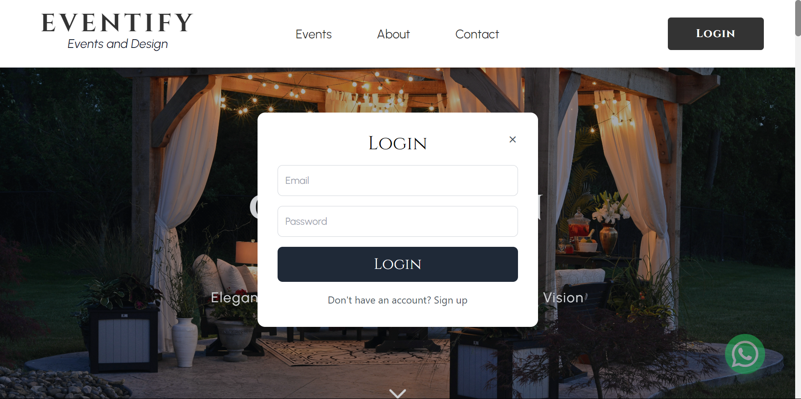
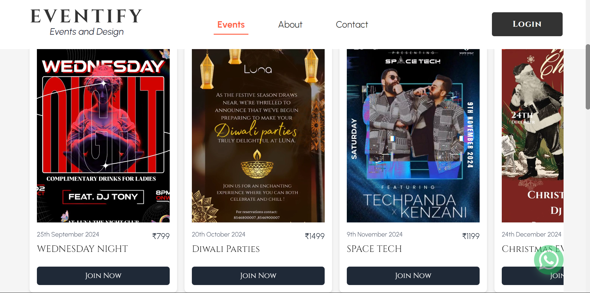
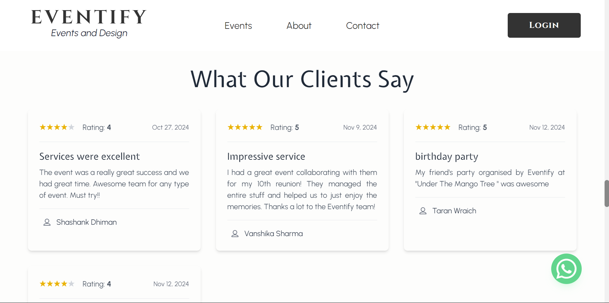

# Eventify - Personal Event Management Platform

Eventify is a cutting-edge platform designed to streamline and personalize event management. Whether it's a birthday party, reunions, anniversary parties, or other personal events, Eventify helps users plan, organize, and execute events with ease. With its modern design and user-friendly interface, Eventify bridges the gap between event organizers and clients by offering real-time communication, and secure payment integrations.


---

## 🚀 Features

### 1. **Event Management**
   - Manage various types of personal events (birthday parties, baby showers, etc.).
   - Customizable event details for every occasion.

### 2. **Real-Time Communication**
   - Connect event organizers with attendees for instant updates.
   - Chat functionality for personalized interactions.

### 3. **Payment Integration**
   - Hassle-free, secure payment gateway for event bookings.
   - Detailed invoice generation and payment tracking.

### 4. **Social Features**
   - Interactive testimonial section showcasing client reviews.
   - Seamless sharing of events across social media platforms.

---

## 📂 Directory Structure

```plaintext
.
├── backend
│   ├── controllers      # Handles application logic
|   |-- config           # Database connectivity
│   ├── models           # MongoDB models for database
│   ├── routes           # API endpoints for the app
│   └── server.js        # Main backend server entry point
├── frontend
│   ├── components       # React components (Home, AboutUs, etc.)
│   ├── context          # Store context for global state
│   ├── pages            # Full-page components (e.g., HomePage, LoginPage)
│   └── App.jsx          # Main app entry point
├── public               # Static assets (e.g., images, favicon)
└── README.md            # Project documentation
```

---

## 🛠️ Tech Stack

### Frontend
- React.js: Component-based library for building the user interface.
- Tailwind CSS: Utility-first framework for responsive and modern UI design.

### Backend
- Node.js: Runtime environment for server-side execution.
- Express.js: Web framework for building RESTful APIs.
- MongoDB: NoSQL database for efficient data storage and retrieval.

### Payment Integration
- Stripe API: Stripe API is integrated in order to incorperate payment system.

---

## 📸 Screenshots
1. Home Page: 
A visually stunning homepage with details on why customers should choose Eventify.


---

2. About Us: 
A warm and personalized page explaining the mission and vision of Eventify.


---

3. Login Page: 
A user-friendly login page to have a proper user registration and user login page.



---

4. Events Page:
A proper page dedicated to events which would be organized by us.



---

5. Testimonial Page:
A testimonial page for proper user review section which has a connectivity with the database and user can directly add on their reviews.



---

## ⚙️ Installation & Setup

### 1. **Clone the Repository**

```bash
git clone https://github.com/dhimanshashank/eventify.git
```

### 2. Backend Setup 
- Navigate to the backend folder:

```bash
cd backend
```

- Install the backend dependency
```bash
npm install
```

- Create a .env file in the backend directory and configure the following:
env
```bash
PORT=4000
MONGO_URI=<Your MongoDB Connection String>
```

- Start the backend server:
```bash
npm start
```

### 3. Frontend Setup
- Navigate to the frontend folder:
```bash
cd ../frontend
```

- Install dependencies:
```bash
npm install
```

- Start the React development server:
```bash
npm start
```

### 4. Database Setup
- Ensure you have a MongoDB database running.
- Use the MongoDB connection string in the MONGO_URI field of your .env file to connect your backend to the database.

---

## 📈 Future Enhancements
- Add advanced search and filter options for events.
- Implement event reminder notifications via email/SMS.

---

## 🤝 Contribution Guidelines
We welcome contributions from the community! To contribute:

- Fork the repository.
- Create a new branch for your feature/bugfix.
- Submit a pull request for review.
